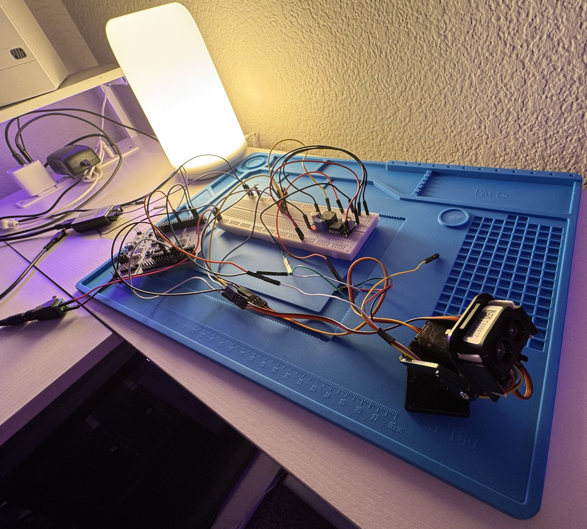
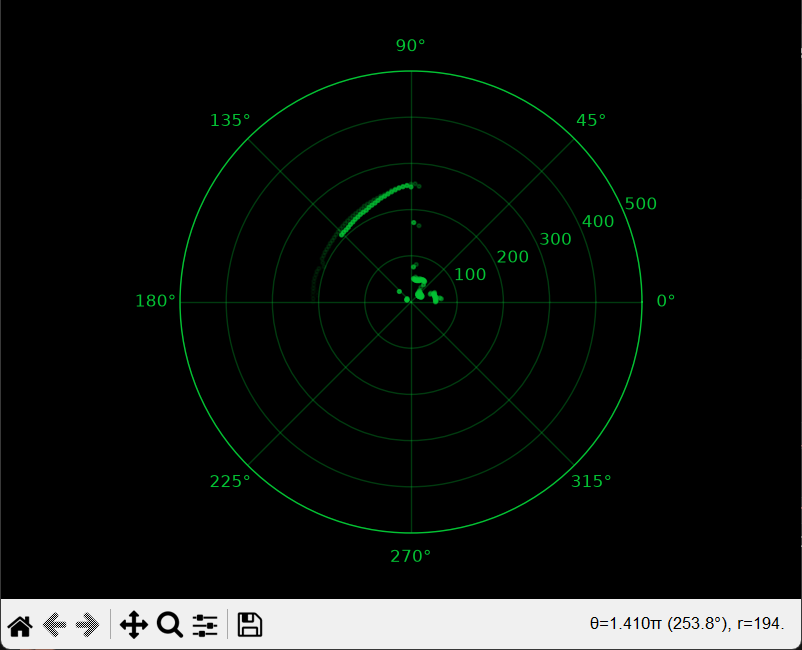

# stm32-lidar-scanner

A two-axis pan-tilt LiDAR scanner on an STM32F446RE Nucleo. Two servos sweep a TF-Luna time-of-flight rangefinder in a raster pattern; the board tags every distance reading with the angle it was taken at and streams the result to a PC, which draws it as a live radar display.

Firmware in C on STM32 HAL, no RTOS. Host visualiser in Python.

<!-- PHOTO: the assembled rig, wide shot, whole gimbal visible. -->


<!-- SCREENSHOT: the radar plot mid-sweep, fade visible. This is the money shot. -->


## Status

**Working**

- Dual-axis servo control from one timer, 50 Hz PWM, verified on a logic analyzer
- Raster scan: pan sweeps continuously, tilt advances one step per sweep
- Non-blocking scheduler — both axes and the sensor run on independent intervals in a single main loop
- TF-Luna driver: interrupt-driven UART receive, sync-word frame parser, checksum validation, error recovery
- Calibrated angles — commanded degrees match measured degrees across the full pan range
- CSV telemetry over USART2
- Live polar plot in Python, cross-platform, with time-based fade

**Next**

- Object detection from scan data
- Closed-loop tracking with PID
- FreeRTOS migration
- Heatmap view for full 3D scans

## Hardware

| Part | Notes |
|---|---|
| NUCLEO-F446RE | STM32F446RE, 180 MHz Cortex-M4 with FPU |
| 2 × MG90S servo | Metal gear, 4.8–6.0 V |
| Benewake TF-Luna | 0.2–8 m, 2° beam, UART at 115200 |
| Pan-tilt bracket | Adafruit mini kit |
| 5 V supply | Dedicated rail for servos and sensor; the Luna's ceiling is 5.2 V with no over-voltage protection |

<!-- PHOTO: breadboard and wiring. Only worth including if it's tidy. -->

### Pin assignment

| Signal | Pin | Peripheral |
|---|---|---|
| Pan servo | PA1 | TIM2_CH2 |
| Tilt servo | PA0 | TIM2_CH1 |
| LiDAR TX → MCU RX | PA10 | USART1_RX |
| MCU TX → LiDAR RX | PA9 | USART1_TX |
| PC telemetry | PA2 / PA3 | USART2 (ST-Link virtual COM) |

### Measured limits

| Axis | Range | Notes |
|---|---|---|
| Pan | 0–180 | Full travel, verified linear, no measurable offset |
| Tilt | 80–115 | 115 is level, lower numbers point up. Mechanical headroom to 150 (downward) unused — a downward beam returns mostly floor |

## How it works

### Servo control

TIM2 runs at 90 MHz from APB1. A prescaler of 89 gives one tick per microsecond; ARR of 19999 wraps the counter every 20 ms, producing the 50 Hz frame hobby servos expect. Because one tick is one microsecond, the compare register holds the pulse width directly:

```
CCR = 500 + (angle / 180) * 2000
```

Both channels share the prescaler and period but have independent compare registers, so one timer drives both axes.

<!-- SCREENSHOT: two-channel logic analyzer capture, both PWM channels rising together with different widths. -->

### Angle calibration

The pulse range was measured rather than assumed. The usual 1000–2000 µs figure produced only about 130° of travel on these servos, so every recorded bearing was roughly 30% short of reality — an error that would have been invisible until it corrupted object detection.

Calibration checked three things:

- **Range** — commanding 0 and 180 should put the beam on a straight line through the pivot. At 500–2500 µs it does.
- **Linearity** — 90 must land midway between the endpoints, or no single scale factor can be correct.
- **Offset** — a flat surface set square to the base, swept across; the minimum distance marks the perpendicular. It falls at pan 90, so the servo's zero agrees with the chassis.

### Scan pattern

Pan steps 2° every 50 ms across its range. At either limit it reverses and tilt advances 3°, giving stacked horizontal rows rather than the diagonal smear you get from stepping both axes independently. A pan sweep takes about 4.5 seconds; a full raster over the 35° tilt range is 12 rows, roughly a minute.

The 50 ms dwell is measured, not guessed. A servo commanded to a new angle is still moving when the next reading arrives, so the reading belongs to a position the code has already left. The size of that error is visible in the data: a sharp edge in the scene lands at different bearings depending on sweep direction, and the split is the lag doubled.

| Dwell | Split |
|---|---|
| 40 ms | 6° |
| 45 ms | 4° |
| 50 ms | 2° |
| 65 ms | 0° |

50 ms is the fastest interval holding the split within one step — the floor, since the true edge always falls between two samples.

### LiDAR

The TF-Luna free-runs at 100 Hz, pushing a nine-byte frame:

```
59 59  Dist_L Dist_H  Amp_L Amp_H  Temp_L Temp_H  Checksum
```

Bytes arrive one at a time by interrupt. A state machine hunts the `0x59 0x59` sync word, collects the remaining seven bytes, and verifies the checksum — the low eight bits of the sum of bytes 0–7 — before decoding.

Two header bytes rather than one, because `0x59` occurs in real data: a distance of 89 cm produces it. Two consecutive occurrences are rare enough to sync on, and the checksum catches the rest.

A reading is rejected when amplitude is below 100, when amplitude reads 65535 (overexposure), or when distance falls outside the sensor's trustworthy range. A distance of 0 means the sensor could not measure, not that nothing is there.

UART errors get their own callback. An overrun or framing error aborts the receive, and without re-arming it the sensor goes silent until reset — a failure that looks like dead hardware. The parser resynchronises on the next header by itself.

<!-- SCREENSHOT: logic analyzer UART decode showing 59 59 and a decoded frame. -->

### Timing

Everything runs off one non-blocking helper:

```c
bool elapsed(uint32_t *last, uint32_t interval);
```

It takes a pointer so it can update the caller's timestamp, letting each timed activity keep its own schedule in the same loop. No blocking delays in normal operation.

Readings are emitted before the next move is commanded, so each one carries the angle the head was actually sitting at rather than the angle it was heading toward.

### Telemetry and display

One CSV line per pan step:

```
pan,tilt,distance,temperature,valid
```

`tools/scanner_plot.py` locates the board by USB vendor and product ID rather than a hardcoded port name, so it runs unchanged on Windows and Linux. Scatter artists are created once and updated per frame rather than clearing the axes, which keeps the redraw cheap.

Points carry a timestamp and fade over 4.5 seconds, so the current sweep stays bright and earlier rows trail behind it. The fade matters because every tilt row draws on the same plot — without it, readings taken at different elevations would be indistinguishable.

## Layout

```
Core/
  Inc/
    servo.h         pan and tilt control interface
    tfluna.h        LiDAR interface
  Src/
    main.c          application loop, scan pattern, timing
    servo.c         PWM generation, angle limits, homing
    tfluna.c        UART receive, frame parser, accessors
tools/
  scanner_plot.py   live polar display
cmake/
  files.cmake       source list
```

Each module keeps its state private and exposes only what callers need. The frame parser and the UART callback are absent from `tfluna.h` — nothing outside the driver has any business feeding bytes to it.

## Building

Requires STM32CubeCLT and the STM32 VS Code extension.

```
cmake --preset Debug
cmake --build build/Debug
```

Peripheral configuration lives in `Iron_Dome.ioc` and is edited with STM32CubeMX. Regenerating preserves everything inside the `USER CODE` markers.

The visualiser needs `pyserial` and `matplotlib`:

```
pip install pyserial matplotlib
python tools/scanner_plot.py
```

Close any serial terminal first — only one program can hold the port.

## Notes from the build

**Measure at the destination, not the source.** Two dead servos and a dead logic analyzer cost most of a day early on. Voltage present at the rail is not voltage present at the connector, and a conclusion reached by eliminating everything else can still be wrong.

**Calibrate before you build on top.** The servo pulse range, the tilt geometry, and the settling time were all wrong in the original notes, and none of the errors were visible in normal operation. A 16° bearing split between sweep directions only showed up because the same scene was captured twice and compared.

**One branch per state.** The parser bug that survived longest was a condition mixing two questions — "am I still hunting for a header?" and "is this byte a header?" — in one test. When the byte was not a header the whole branch failed and control fell through to the collecting branch, which started assembling a frame from the middle of the previous one.

**Power conversion is the least reliable part of a breadboard.** A buck converter's stiff pins splay the contacts they are pushed into, and every junction in the power path is a friction fit carrying current spikes. Replaced with a direct regulated supply and screw terminals.
